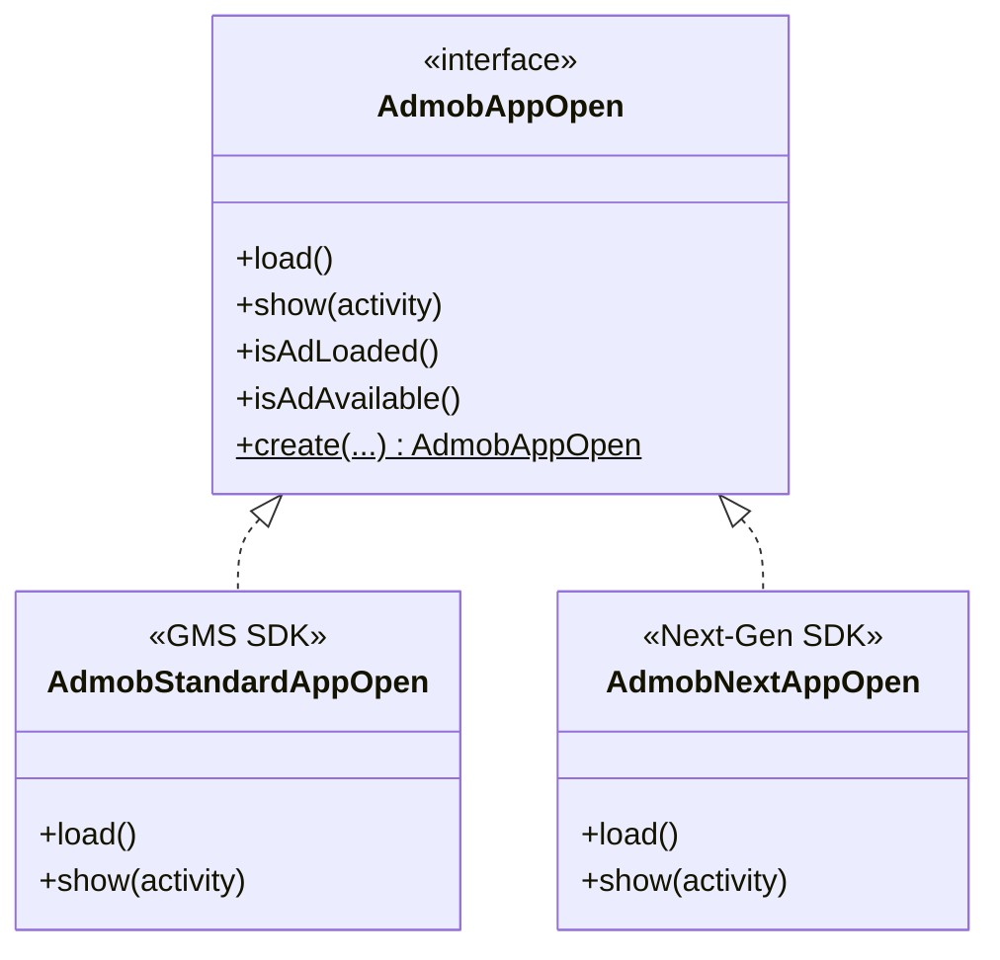

# AdMob App Open Ads Integration

This package houses the **App Open Ads** integration for the OzAds library. It supports both the **Standard GMS AdMob SDK** and the **GMA Next-Gen SDK** dynamically at runtime.

---

## 🏗️ Architecture & How It Works

We employ a **Polymorphic Interface + Companion Factory** pattern to segregate SDK implementations:



### Dynamic Factory Resolution
The client application and core view wrappers interact solely with the `AdmobAppOpen` interface. The implementation is resolved dynamically at instantiation time:
```kotlin
val appOpenAd = AdmobAppOpen.create(context, adUnitId, listener)
```

---

## 🔄 Standard vs. Next-Gen Comparison

| Feature | Standard GMS SDK (`AdmobStandardAppOpen`) | GMA Next-Gen SDK (`AdmobNextAppOpen`) |
|---|---|---|
| **Underlying Class** | `com.google.android.gms.ads.appopen.AppOpenAd` | `com.google.android.libraries.ads.mobile.sdk.appopen.AppOpenAd` |
| **API Architecture** | Imperative, main-thread loading | Modern, asynchronous, background-safe loading |
| **Expiration Check** | Checked manually in client app | Automatically handled using `Date().time` threshold |

---

## 📖 Official Next-Gen Integration Guide Below
*(The section below contains Google's official documentation for the GMA Next-Gen SDK)*

# App open ads

Select platform: AndroidNew-selected Android iOS Unity Flutter
This guide is intended for publishers integrating app open ads using GMA Next-Gen SDK.

App open ads are a special ad format intended for publishers wishing to monetize their app load screens. App open ads can be closed at any time, and are designed to be shown when your users bring your app to the foreground.

Note: Specific format may vary by region.
App open ads automatically show a small branding area so users know they're in your app. Here is an example of what an app open ad looks like:


Prerequisites
Before you continue, set up GMA Next-Gen SDK.

Always test with test ads
When building and testing your apps, make sure you use test ads rather than live, production ads. Failure to do so can lead to suspension of your account.

The easiest way to load test ads is to use our dedicated test ad unit ID for app open ads:


ca-app-pub-3940256099942544/9257395921
It's been specially configured to return test ads for every request, and you're free to use it in your own apps while coding, testing, and debugging. Just make sure you replace it with your own ad unit ID before publishing your app.

For more information about how GMA Next-Gen SDK test ads work, see Enable test ads.

Extend the Application class
Create a new class that extends the Application class. This provides a lifecycle-aware way to manage ads that are tied to the application's state rather than a single Activity:

Kotlin
Java

/** Application class that initializes, loads and show ads when activities change states. */
class MyApplication : Application() {

override fun onCreate() {
super<Application>.onCreate()
CoroutineScope(Dispatchers.IO).launch {
// Initialize the Mobile Ads SDK synchronously on a background thread.
MobileAds.initialize(this@MyApplication, InitializationConfig.Builder(APP_ID).build()) {}
}
}

private companion object {
// Sample AdMob App ID.
const val APP_ID = "ca-app-pub-3940256099942544~3347511713"
}
}
This provides the skeleton where you'll later register for app foregrounding events.

Next, add the following code to your AndroidManifest.xml:


<!-- TODO: Update to reference your actual package name. -->
<application
android:name="com.google.android.gms.example.appopendemo.MyApplication" ...>
...
</application>
Implement your utility component
Your ad should show quickly, so it's best to load your ad before you need to display it. That way, you'll have an ad ready to go as soon as your user enters into your app.

Implement a utility component AppOpenAdManager to encapsulate the work related to loading and showing App Open ads:

Kotlin
Java

/**
* Interface definition for a callback to be invoked when an app open ad is complete (i.e. dismissed
* or fails to show).
  */
  fun interface OnShowAdCompleteListener {
  fun onShowAdComplete()
  }

/** Singleton object that loads and shows app open ads. */
object AppOpenAdManager {
private var appOpenAd: AppOpenAd? = null
private var isLoadingAd = false
var isShowingAd = false

/**
* Load an ad.
*
* @param context a context used to perform UI-related operations (e.g. display Toast messages).
*   Showing the app open ad itself does not require a context.
    */
    fun loadAd(context: Context) {
    // We will implement this later.
    }

/**
* Show the ad if one isn't already showing.
*
* @param activity the activity that shows the app open ad.
* @param onShowAdCompleteListener the listener to be notified when an app open ad is complete.
  */
  fun showAdIfAvailable(activity: Activity, onShowAdCompleteListener: OnShowAdCompleteListener?) {
  // We will implement this later.
  }

/** Check if ad exists and can be shown. */
private fun isAdAvailable(): Boolean {
return appOpenAd != null
}
}
Now that you have a utility class, you can instantiate it in your MyApplication class:

Java
Kotlin

class MyApplication : Application() {

private lateinit var appOpenAdManager: AppOpenAdManager

override fun onCreate() {
super.onCreate()
val backgroundScope = CoroutineScope(Dispatchers.IO)
backgroundScope.launch {
// Initialize GMA Next-Gen SDK on a background thread.
MobileAds.initialize(this@MyApplication) {}
}
appOpenAdManager = AppOpenAdManager()
}
}
To use the AppOpenAdManager, call the public wrapper methods on the singleton MyApplication instance. The Application class interfaces with the rest of the code, delegating the work of loading and showing the ad to the manager.

Load an ad
The next step is to fill out the loadAd() method and handle the ad load callbacks.

Kotlin
Java


/**
* Load an ad.
*
* @param context a context used to perform UI-related operations (e.g. display Toast messages).
*   Loading the app open ad itself does not require a context.
    */
    fun loadAd(context: Context) {
    // Do not load ad if there is an unused ad or one is already loading.
    if (isLoadingAd || isAdAvailable()) {
    Log.d(Constant.TAG, "App open ad is either loading or has already loaded.")
    return
    }

isLoadingAd = true
AppOpenAd.load(
AdRequest.Builder(AppOpenFragment.AD_UNIT_ID).build(),
object : AdLoadCallback<AppOpenAd> {
/**
* Called when an app open ad has loaded.
*
* @param ad the loaded app open ad.
*/
override fun onAdLoaded(ad: AppOpenAd) {
// Called when an ad has loaded.
appOpenAd = ad
isLoadingAd = false
Log.d(Constant.TAG, "App open ad loaded.")
}

      /**
       * Called when an app open ad has failed to load.
       *
       * @param loadAdError the error.
       */
      override fun onAdFailedToLoad(loadAdError: LoadAdError) {
        isLoadingAd = false
        Log.w(Constant.TAG, "App open ad failed to load: $loadAdError")
      }
    },
)
}

Replace AD_UNIT_ID with your own ad unit ID.

Show the ad
The most common app open implementation is to attempt to show an app open ad near app launch, start app content if the ad isn't ready, and preload another ad for the next app open opportunity. See App open ad guidance for implementation examples.

The following code shows and subsequently reloads an ad:

Kotlin
Java

/**
* Show the ad if one isn't already showing.
*
* @param activity the activity that shows the app open ad.
* @param onShowAdCompleteListener the listener to be notified when an app open ad is complete.
  */
  fun showAdIfAvailable(activity: Activity, onShowAdCompleteListener: OnShowAdCompleteListener?) {
  // If the app open ad is already showing, do not show the ad again.
  if (isShowingAd) {
  Log.d(Constant.TAG, "App open ad is already showing.")
  onShowAdCompleteListener?.onShowAdComplete()
  return
  }

// If the app open ad is not available yet, invoke the callback.
if (!isAdAvailable()) {
Log.d(Constant.TAG, "App open ad is not ready yet.")
onShowAdCompleteListener?.onShowAdComplete()
return
}

appOpenAd?.adEventCallback =
object : AppOpenAdEventCallback {
override fun onAdShowedFullScreenContent() {
Log.d(Constant.TAG, "App open ad showed.")
}

      override fun onAdDismissedFullScreenContent() {
        Log.d(Constant.TAG, "App open ad dismissed.")
        appOpenAd = null
        isShowingAd = false
        onShowAdCompleteListener?.onShowAdComplete()
        loadAd(activity)
      }

      override fun onAdFailedToShowFullScreenContent(
        fullScreenContentError: FullScreenContentError
      ) {
        appOpenAd = null
        isShowingAd = false
        Log.w(Constant.TAG, "App open ad failed to show: $fullScreenContentError")
        onShowAdCompleteListener?.onShowAdComplete()
        loadAd(activity)
      }

      override fun onAdImpression() {
        Log.d(Constant.TAG, "App open ad recorded an impression.")
      }

      override fun onAdClicked() {
        Log.d(Constant.TAG, "App open ad recorded a click.")
      }
    }

isShowingAd = true
appOpenAd?.show(activity)
}

The AppOpenAdEventCallback handles events such as when the ad is presented, fails to present, or when it is dismissed.

Key Point: If a user returns to your app after having left it by clicking on an app open ad, it makes sure they're not presented with another app open ad.
Consider ad expiration
Key Point: App open ads will time out after four hours. Ads rendered more than four hours after request time will no longer be valid and may not earn revenue.
To make sure you don't show an expired ad, add a method to the AppOpenAdManager that checks how long it has been since your ad reference loaded. Then, use that method to check if the ad is still valid.

Kotlin
Java

object AppOpenAdManager {
// ...
/** Keep track of the time an app open ad is loaded to make sure you don't show an expired ad. */
private var loadTime: Long = 0;

/**
* Load an ad.
*
* @param context a context used to perform UI-related operations (e.g. display Toast messages).
*   Loading the app open ad itself does not require a context.
    */
    fun loadAd(context: Context) {
    // Do not load ad if there is an unused ad or one is already loading.
    if (isLoadingAd || isAdAvailable()) {
    Log.d(Constant.TAG, "App open ad is either loading or has already loaded.")
    return
    }

    isLoadingAd = true
    AppOpenAd.load(
      AdRequest.Builder(AppOpenFragment.AD_UNIT_ID).build(),
      object : AdLoadCallback<AppOpenAd> {
        /**
         * Called when an app open ad has loaded.
         *
         * @param ad the loaded app open ad.
         */
        override fun onAdLoaded(ad: AppOpenAd) {
          // Called when an ad has loaded.
          appOpenAd = ad
          isLoadingAd = false
          loadTime = Date().time
          Log.d(Constant.TAG, "App open ad loaded.")
        }

        /**
         * Called when an app open ad has failed to load.
         *
         * @param loadAdError the error.
         */
        override fun onAdFailedToLoad(loadAdError: LoadAdError) {
          isLoadingAd = false
          Log.w(Constant.TAG, "App open ad failed to load: $loadAdError")
        }
      },
    )
}

// ...

/** Check if ad was loaded more than n hours ago. */
private fun wasLoadTimeLessThanNHoursAgo(numHours: Long): Boolean {
val dateDifference: Long = Date().time - loadTime
val numMilliSecondsPerHour: Long = 3600000
return dateDifference < numMilliSecondsPerHour * numHours
}

/** Check if ad exists and can be shown. */
private fun isAdAvailable(): Boolean {
// App open ads expire after four hours. Ads rendered more than four hours after request time
// are no longer valid and may not earn revenue.
return appOpenAd != null && wasLoadTimeLessThanNHoursAgo(4)
}
}
Keep track of current activity
To show the ad, you'll need an Activity context. To keep track of the most current activity being used, register for and implement the Application.ActivityLifecycleCallbacks.

Kotlin
Java

class MyApplication : Application(), Application.ActivityLifecycleCallbacks {

private var currentActivity: Activity? = null

override fun onCreate() {
super<Application>.onCreate()
registerActivityLifecycleCallbacks(this)
}

/** ActivityLifecycleCallback methods. */
override fun onActivityCreated(activity: Activity, savedInstanceState: Bundle?) {}

override fun onActivityStarted(activity: Activity) {
currentActivity = activity
}

override fun onActivityResumed(activity: Activity) {}

override fun onActivityPaused(activity: Activity) {}

override fun onActivityStopped(activity: Activity) {}

override fun onActivitySaveInstanceState(activity: Activity, outState: Bundle) {}

override fun onActivityDestroyed(activity: Activity) {}

// ...
}
registerActivityLifecycleCallbacks lets you listen for all Activity events. By listening for when activities are started and destroyed, you can keep track of a reference to the current Activity, which you then will use in presenting your app open ad.

Listen for app foregrounding events
To listen for app foreground events, do the following steps:

Add the libraries to your gradle file
To be notified of app foregrounding events, you need to register a DefaultLifecycleObserver. Add its dependency to your app-level build file:

Kotlin
Groovy

dependencies {
implementation("com.google.android.libraries.ads.mobile.sdk:ads-mobile-sdk:1.2.1")
implementation("androidx.lifecycle:lifecycle-process:2.8.3")
}
Implement the lifecycle observer interface
You can listen for foregrounding events by implementing the DefaultLifecycleObserver interface.

Implement the onStart() to show the app open ad.

Kotlin
Java

class MyApplication :
Application(), Application.ActivityLifecycleCallbacks, DefaultLifecycleObserver {

private var currentActivity: Activity? = null

override fun onCreate() {
super<Application>.onCreate()
registerActivityLifecycleCallbacks(this)
ProcessLifecycleOwner.get().lifecycle.addObserver(this)
}

/**
* DefaultLifecycleObserver method that shows the app open ad when the app moves to foreground.
  */
  override fun onStart(owner: LifecycleOwner) {
  currentActivity?.let { activity ->
  AppOpenAdManager.showAdIfAvailable(activity, null)
  }
  }

// ...
}
Cold starts and loading screens
The documentation thus far assumes that you only show app open ads when users foreground your app when it is suspended in memory. "Cold starts" occur when your app is launched but was not previously suspended in memory.

An example of a cold start is when a user opens your app for the first time. With cold starts, you won't have a previously loaded app open ad that's ready to be shown right away. The delay between when you request an ad and receive an ad back can create a situation where users are able to briefly use your app before being surprised by an out of context ad. This should be avoided because it is a bad user experience.

The preferred way to use app open ads on cold starts is to use a loading screen to load your game or app assets, and to only show the ad from the loading screen. If your app has completed loading and has sent the user to the main content of your app, don't show the ad.

Key Point: To continue loading app assets while the app open ad is being displayed, always load assets in a background thread.
Best practices
App open ads help you monetize your app's loading screen, when the app first launches and during app switches, but it's important to keep best practices in mind so that your users enjoy using your app. It's best to:

Show your first app open ad after your users have used your app a few times.
Show app open ads during times when your users would otherwise be waiting for your app to load.
If you have a loading screen under the app open ad, and your loading screen completes loading before the ad is dismissed, you may want to dismiss your loading screen in the onAdDismissedFullScreenContent() method.
Example
Download and run the example app that demonstrates the use of the GMA Next-Gen SDK.