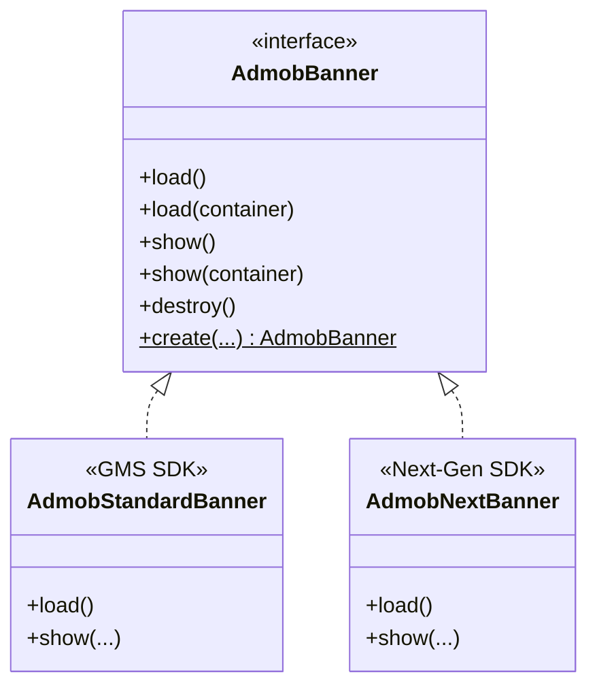

# AdMob Banner Ads Integration

This package houses the **Banner Ads** integration for the OzAds library. It supports both the **Standard GMS AdMob SDK** and the **GMA Next-Gen SDK** dynamically at runtime.

---

## 🏗️ Architecture & How It Works

We employ a **Polymorphic Interface + Companion Factory** pattern to segregate SDK implementations:



### Dynamic Factory Resolution
The client application and core view wrappers interact solely with the `AdmobBanner` interface. The implementation is resolved dynamically at instantiation time:
```kotlin
val bannerAd = AdmobBanner.create(context, adUnitId, listener)
```

---

## 🔄 Standard vs. Next-Gen Comparison

| Feature | Standard GMS SDK (`AdmobStandardBanner`) | GMA Next-Gen SDK (`AdmobNextBanner`) |
|---|---|---|
| **Underlying Class** | `com.google.android.gms.ads.adview.AdView` | `com.google.android.libraries.ads.mobile.sdk.banner.AdView` |
| **API Architecture** | Imperative, main-thread loading | Modern, asynchronous, background-safe loading |
| **Adaptive Sizing** | Anchored adaptive banner size via GMS APIs | Adaptive banner size via Next-Gen SDK APIs |

---

## 📖 Official Next-Gen Integration Guide Below
*(The section below contains Google's official documentation for the GMA Next-Gen SDK)*

# Set up banner ads

Select platform: AndroidNew-selected Android iOS Unity Flutter


Banner ads are rectangular ads that occupy a portion of an app's layout. Anchored adaptive banners are fixed aspect ratio ads that stay on screen while users are interacting with the app, either anchored at the top or bottom of the screen.
This guide covers loading an anchored adaptive banner ad into an Android app.

Prerequisites
Set up GMA Next-Gen SDK.
Always test with test ads
When building and testing your apps, make sure you use test ads rather than live, production ads. Failure to do so can lead to suspension of your account.

The easiest way to load test ads is to use our dedicated test ad unit ID for Android banners:

ca-app-pub-3940256099942544/9214589741

It's been specially configured to return test ads for every request, and you can use it in your own apps while coding, testing, and debugging. Just make sure you replace it with your own ad unit ID before publishing your app.

For more information about how GMA Next-Gen SDK test ads work, see Enable test ads.


Create an AdView object
To display banners, do the following:

Kotlin
Java
XML Layout
Jetpack Compose
Create an AdView object.
Add the AdView object to your app's layout.
The following example creates and adds the AdView object to an app layout:


private fun createAdView(adViewContainer: FrameLayout, activity: Activity) {
val adView = AdView(activity)
adViewContainer.addView(adView)
}

Load an ad
The following example loads a 360-width anchored adaptive banner ad into an AdView object:

Kotlin
Java
Jetpack Compose

private fun loadBannerAd(adView: AdView, activity: Activity) {
// Get a BannerAdRequest for a 360 wide large anchored adaptive banner ad.
val adSize = AdSize.getLargeAnchoredAdaptiveBannerAdSize(activity, 360)
val adRequest = BannerAdRequest.Builder(AD_UNIT_ID, adSize).build()

adView.loadAd(
adRequest,
object : AdLoadCallback<BannerAd> {
override fun onAdLoaded(ad: BannerAd) {
Log.d(TAG, "Banner ad loaded.")
}

      override fun onAdFailedToLoad(adError: LoadAdError) {
        Log.d(TAG, "Banner ad failed to load: $adError")
      }
    },
)
}

Refresh an ad
If you configured your ad unit to refresh, you don't need to request another ad when the ad fails to load. GMA Next-Gen SDK respects any refresh rate you specified in the AdMob UI. If you haven't enabled refresh, issue a new request. For more details on ad unit refresh, such as setting a refresh rate, see Use automatic refresh for Banner ads.

Note: When setting a refresh rate in the AdMob UI, the automatic refresh occurs only if the banner is visible on screen.
Release an ad resource
When you are finished using a banner ad, you can release the banner ad's resources.

To release the ad's resource, you remove the ad from the view hierarchy and drop all its references:

Kotlin
Java
Jetpack Compose

// Remove banner from view hierarchy.
val parentView = adView?.parent
if (parentView is ViewGroup) {
parentView.removeView(adView)
}

// Destroy the banner ad resources.
adView?.destroy()

// Drop reference to the banner ad.
adView = null
Ad events
You can listen for a number of events in the ad's lifecycle, including ad impression and click, as well as ad opening and closing. It is recommended to set the callback before showing the banner.


Kotlin
Java

override fun onAdLoaded(ad: BannerAd) {
ad.adEventCallback =
object : BannerAdEventCallback {
override fun onAdImpression() {
// Banner ad recorded an impression.
Log.d(TAG, "Banner ad recorded an impression.")
}

      override fun onAdClicked() {
        // Banner ad recorded a click.
        Log.d(TAG, "Banner ad clicked.")
      }

      override fun onAdShowedFullScreenContent() {
        // Banner ad showed.
        Log.d(TAG, "Banner ad showed full screen content.")
      }

      override fun onAdDismissedFullScreenContent() {
        // Banner ad dismissed.
        Log.d(TAG, "Banner ad dismissed full screen content.")
      }

      override fun onAdFailedToShowFullScreenContent(
        fullScreenContentError: FullScreenContentError
      ) {
        // Banner ad failed to show.
        Log.w(TAG, "Banner ad failed to show full screen content: $fullScreenContentError")
      }
    }
}


Ad refresh callback
The BannerAdRefreshCallback handles ad refreshing events if you use automatic refresh for banner ads. Make sure to set the callback before the you add the ad view to your view hierarchy. For details on ad refreshing, see Refresh an ad.

Kotlin
Java

BannerAd.load(
BannerAdRequest.Builder("ca-app-pub-3940256099942544/9214589741", adSize).build(),
object : AdLoadCallback<BannerAd> {
override fun onAdLoaded(ad: BannerAd) {
ad.bannerAdRefreshCallback =
object : BannerAdRefreshCallback {
// Set the ad refresh callbacks.
override fun onAdRefreshed() {
// Called when the ad refreshes.
}

          override fun onAdFailedToRefresh(loadAdError: LoadAdError) {
            // Called when the ad fails to refresh.
          }
        }

      // ...
    }
}
)
Hardware acceleration for video ads
In order for video ads to show successfully in your banner ad views, hardware acceleration must be enabled.

Hardware acceleration is enabled by default, but some apps may choose to disable it. If this applies to your app, we recommend enabling hardware acceleration for Activity classes that use ads.

Enable hardware acceleration
If your app does not behave properly with hardware acceleration turned on globally, you can control it for individual activities as well. To enable or disable hardware acceleration, you can use the android:hardwareAccelerated attribute for the <application> and <activity> elements in your AndroidManifest.xml. The following example enables hardware acceleration for the entire app but disables it for one activity:


<application android:hardwareAccelerated="true">
    <!-- For activities that use ads, hardwareAcceleration should be true. -->
    <activity android:hardwareAccelerated="true" />
    <!-- For activities that don't use ads, hardwareAcceleration can be false. -->
    <activity android:hardwareAccelerated="false" />
</application>
See the Hardware acceleration guide for more information about options for controlling hardware acceleration. Note that individual ad views cannot be enabled for hardware acceleration if the activity is disabled, so the activity itself must have hardware acceleration enabled.

Download and run the example app that demonstrates the use of the GMA Next-Gen SDK.