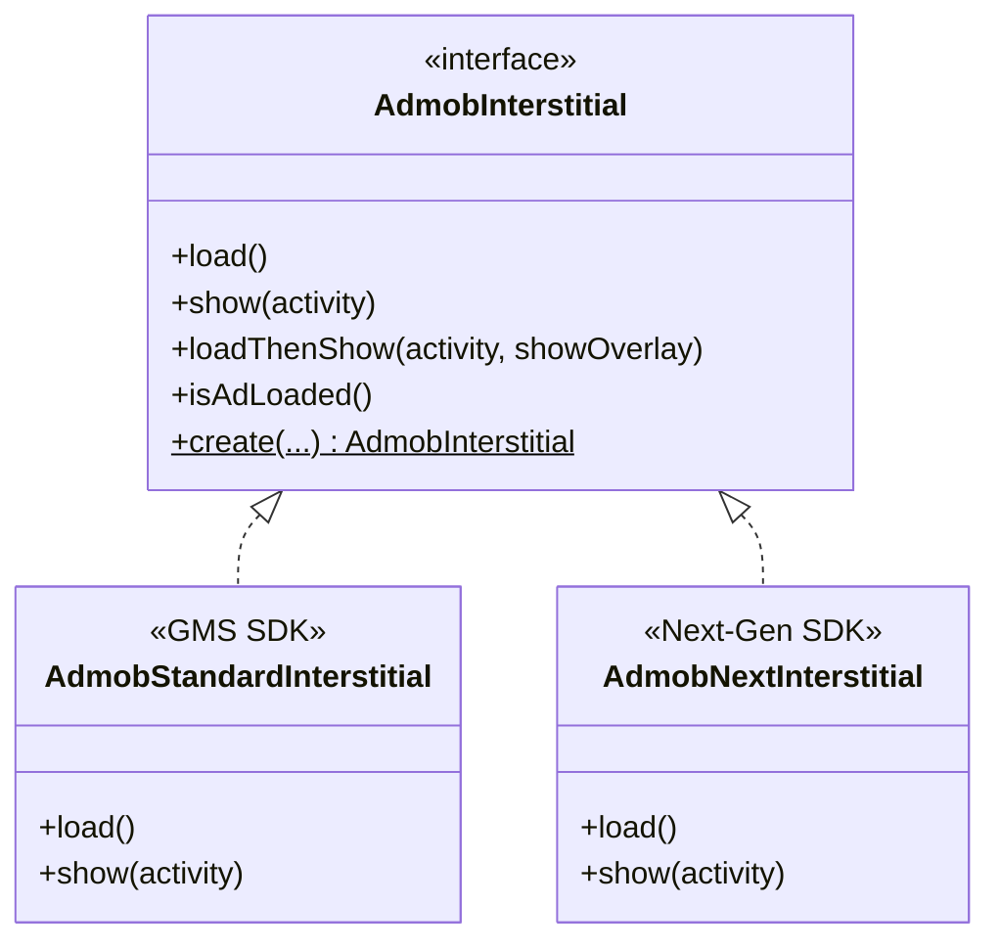

# AdMob Interstitial Ads Integration

This package houses the **Interstitial Ads** integration for the OzAds library. It supports both the **Standard GMS AdMob SDK** and the **GMA Next-Gen SDK** dynamically at runtime.

---

## 🏗️ Architecture & How It Works

We employ a **Polymorphic Interface + Companion Factory** pattern to segregate SDK implementations:



### Dynamic Factory Resolution
The client application and core view wrappers interact solely with the `AdmobInterstitial` interface. The implementation is resolved dynamically at instantiation time:
```kotlin
val intersAd = AdmobInterstitial.create(context, adUnitId, listener)
```

---

## 🔄 Standard vs. Next-Gen Comparison

| Feature | Standard GMS SDK (`AdmobStandardInterstitial`) | GMA Next-Gen SDK (`AdmobNextInterstitial`) |
|---|---|---|
| **Underlying Class** | `com.google.android.gms.ads.interstitial.InterstitialAd` | `com.google.android.libraries.ads.mobile.sdk.interstitial.InterstitialAd` |
| **API Architecture** | Imperative, main-thread loading | Modern, asynchronous, background-safe loading |
| **Preloading** | Preload via standard lifecycle hooks | Built-in SDK-level Preloader (`InterstitialAdPreloader`) |

---

## 📖 Official Next-Gen Integration Guide Below
*(The section below contains Google's official documentation for the GMA Next-Gen SDK)*

# Interstitial ads

Select platform: AndroidNew-selected Android iOS Unity Flutter


Interstitial ads are full-screen ads that cover the interface of their host app. They're typically displayed at natural transition points in the flow of an app, such as between activities or during the pause between levels in a game. When an app shows an interstitial ad, the user has the choice to either tap on the ad and continue to its destination or close it and return to the app. Read one of our case studies.

This guide explains how to integrate interstitial ads into an Android app.

Prerequisites
Set up GMA Next-Gen SDK.
Always test with test ads
When building and testing your apps, make sure you use test ads rather than live, production ads. Failure to do so can lead to suspension of your account.

The easiest way to load test ads is to use our dedicated test ad unit ID for Android interstitials:

ca-app-pub-3940256099942544/1033173712

It's been specially configured to return test ads for every request, and you're free to use it in your own apps while coding, testing, and debugging. Just make sure you replace it with your own ad unit ID before publishing your app.

For details on GMA Next-Gen SDK test ads, see Enable test ads.

Load an ad
To load an ad, GMA Next-Gen SDK offers the following:

Load with the single ad loading API.

Load with the ad preloading API, which eliminates the need for manual ad loading and caching.

Load with the single ad loading API
The following example shows you how to load a single ad:

Kotlin
Java

import com.google.android.libraries.ads.mobile.sdk.common.AdLoadCallback
import com.google.android.libraries.ads.mobile.sdk.common.AdRequest
import com.google.android.libraries.ads.mobile.sdk.common.FullScreenContentError
import com.google.android.libraries.ads.mobile.sdk.common.LoadAdError
import com.google.android.libraries.ads.mobile.sdk.interstitial.InterstitialAd
import com.google.android.libraries.ads.mobile.sdk.interstitial.InterstitialAdEventCallback
import com.google.android.libraries.ads.mobile.sdk.MobileAds

class InterstitialActivity : Activity() {
private var interstitialAd: InterstitialAd? = null

override fun onCreate(savedInstanceState: Bundle?) {
super.onCreate(savedInstanceState)

    // Load ads after you initialize GMA Next-Gen SDK.
    InterstitialAd.load(
      AdRequest.Builder(AD_UNIT_ID).build(),
      object : AdLoadCallback<InterstitialAd> {
        override fun onAdLoaded(ad: InterstitialAd) {
          // Interstitial ad loaded.
          interstitialAd = ad
        }

        override fun onAdFailedToLoad(adError: LoadAdError) {
          // Interstitial ad failed to load.
          interstitialAd = null
        }
      },
    )
}

companion object {
// Sample interstitial ad unit ID.
const val AD_UNIT_ID = "ca-app-pub-3940256099942544/1033173712"
}
}
Load with the ad preloading API
To start preloading, do the following:

Initialize a preload configuration with an ad request.

Start the preloader for interstitial ads with your ad unit ID and preload configuration:

Kotlin
Java

private fun startPreloading(adUnitId: String) {
val adRequest = AdRequest.Builder(adUnitId).build()
val preloadConfig = PreloadConfiguration(adRequest)
InterstitialAdPreloader.start(adUnitId, preloadConfig)
}

Ads are continuously made available as you show them. The following example polls for an ad from the preloader:

Kotlin
Java

// Polling returns the next available ad and loads another ad in the background.
val ad = InterstitialAdPreloader.pollAd(adUnitId)

Set the InterstitialAdEventCallback
The InterstitialAdEventCallback handles events related to displaying your InterstitialAd. Before showing the interstitial ad, make sure to set the callback:

Kotlin
Java

// Listen for ad events.
interstitialAd?.adEventCallback =
object : InterstitialAdEventCallback {
override fun onAdShowedFullScreenContent() {
// Interstitial ad did show.
}

    override fun onAdDismissedFullScreenContent() {
      // Interstitial ad did dismiss.
      interstitialAd = null
    }

    override fun onAdFailedToShowFullScreenContent(
      fullScreenContentError: FullScreenContentError
    ) {
      // Interstitial ad failed to show.
      interstitialAd = null
    }

    override fun onAdImpression() {
      // Interstitial ad did record an impression.
    }

    override fun onAdClicked() {
      // Interstitial ad did record a click.
    }
}
Show the ad
To show an interstitial ad, use the show() method.

Kotlin
Java

// Show the ad.
interstitialAd?.show(this@InterstitialActivity)
Some best practices
Consider whether interstitial ads are the right type of ad for your app.
Interstitial ads work best in apps with natural transition points. The conclusion of a task within an app, like sharing an image or completing a game level, creates such a point. Make sure you consider at which points in your app's workflow you'll display interstitial ads and how the user is likely to respond.
Remember to pause the action when displaying an interstitial ad.
There are a number of different types of interstitial ads: text, image, video, and more. It's important to make sure that when your app displays an interstitial ad, it also suspends its use of some resources to allow the ad to take advantage of them. For example, when you make the call to display an interstitial ad, be sure to pause any audio output being produced by your app.
Allow for adequate loading time.
Just as it's important to make sure you display interstitial ads at an appropriate time, it's also important to make sure the user doesn't have to wait for them to load. Loading the ad in advance by calling load() before you intend to call show() can ensure that your app has a fully loaded interstitial ad at the ready when the time comes to display one.
Don't flood the user with ads.
While increasing the frequency of interstitial ads in your app might seem like a great way to increase revenue, it can also degrade the user experience and lower clickthrough rates. Make sure that users aren't so frequently interrupted that they're no longer able to enjoy the use of your app.
Example
Download and run the example app that demonstrates the use of the GMA Next-Gen SDK.