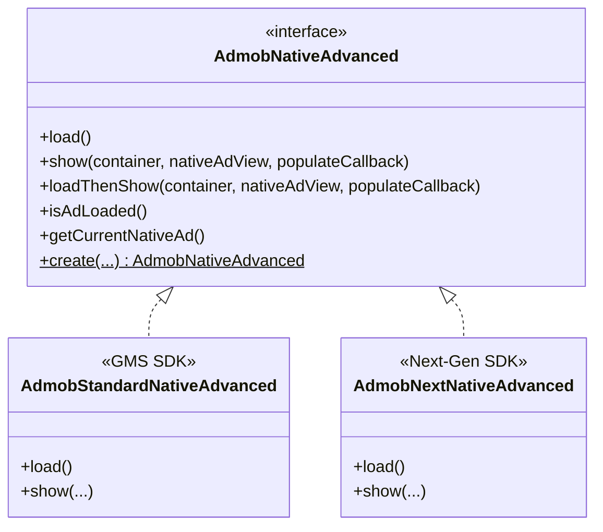

# AdMob Native Advanced Ads Integration

This package houses the **Native Advanced Ads** integration for the OzAds library. It supports both the **Standard GMS AdMob SDK** and the **GMA Next-Gen SDK** dynamically at runtime.

---

## 🏗️ Architecture & How It Works

We employ a **Polymorphic Interface + Companion Factory** pattern to segregate SDK implementations:



### Dynamic Factory Resolution
The client application and core view wrappers interact solely with the `AdmobNativeAdvanced` interface. The implementation is resolved dynamically at instantiation time:
```kotlin
val nativeAd = AdmobNativeAdvanced.create(context, adUnitId, listener)
```

---

## 🔄 Standard vs. Next-Gen Comparison

| Feature | Standard GMS SDK (`AdmobStandardNativeAdvanced`) | GMA Next-Gen SDK (`AdmobNextNativeAdvanced`) |
|---|---|---|
| **Underlying Class** | `com.google.android.gms.ads.nativead.NativeAd` | `com.google.android.libraries.ads.mobile.sdk.nativead.NativeAd` |
| **API Architecture** | Imperative, main-thread loading | Modern, asynchronous, background-safe loading |
| **Container View** | Wraps layout view inside `com.google.android.gms.ads.nativead.NativeAdView` | Wraps layout view inside `com.google.android.libraries.ads.mobile.sdk.nativead.NativeAdView` |

---

## 📖 Official Next-Gen Integration Guide Below
*(The section below contains Google's official documentation for the GMA Next-Gen SDK)*

Native ads are ad assets that are presented to users through UI components that are native to the platform. They're shown using the same types of views with which you're already building your layouts, and can be formatted to match your app's visual design.

When a native ad loads, your app receives an ad object that contains its assets, and the app—rather than GMA Next-Gen SDK—is then responsible for displaying them.

Broadly speaking, there are two parts to successfully implementing native ads: Loading an ad using the SDK and then displaying the ad content in your app.

This page shows how to use the SDK to load native ads. Tip: Learn more about native ads in our Native Ads Playbook.

Samples are available for Java and Kotlin.
You can also check out some customer success stories: case study 1, case study 2.

Prerequisites
Set up GMA Next-Gen SDK.
GMA Next-Gen SDK 0.6.0-alpha01 or higher.
Always test with test ads
When building and testing your apps, make sure you use test ads rather than live, production ads. Failure to do so can lead to suspension of your account.

The easiest way to load test ads is to use our dedicated test ad unit ID for native ads:

Ad format	Sample ad unit ID
Native	ca-app-pub-3940256099942544/2247696110
Native Video	ca-app-pub-3940256099942544/1044960115
Load an ad
Warning: Before loading ads, you must initialize GMA Next-Gen SDK.
To load a native ad, call NativeAdLoader.load() method, which takes a NativeAdRequest and a NativeAdLoaderCallback.


import com.google.android.libraries.ads.mobile.sdk.common.LoadAdError
import com.google.android.libraries.ads.mobile.sdk.nativead.NativeAd
import com.google.android.libraries.ads.mobile.sdk.nativead.NativeAdLoader
import com.google.android.libraries.ads.mobile.sdk.nativead.NativeAdLoaderCallback
import com.google.android.libraries.ads.mobile.sdk.nativead.NativeAdRequest

class NativeFragment : Fragment() {

private var nativeAd: NativeAd? = null

override fun onViewCreated(view: View, savedInstanceState: Bundle?) {
super.onViewCreated(view, savedInstanceState)
loadAd()
}

private fun loadAd() {
// Build an ad request with native ad options to customize the ad.
val adRequest = NativeAdRequest
.Builder(AD_UNIT_ID, listOf(NativeAd.NativeAdType.NATIVE))
.build()

    val adCallback =
      object : NativeAdLoaderCallback {
        override fun onNativeAdLoaded(nativeAd: NativeAd) {
          // Called when a native ad has loaded.
        }
        override fun onAdFailedToLoad(adError: LoadAdError) {
          // Called when a native ad has failed to load.
        }
      }

    // Load the native ad with our request and callback.
    NativeAdLoader.load(adRequest, adCallback)
}

companion object {
// Sample native ad unit ID.
const val AD_UNIT_ID = "ca-app-pub-3940256099942544/2247696110"
}
}
Set the native ad event callback
When handling onNativeAdLoaded, set the received NativeAd with a NativeAdEventCallback to define functions for receiving native ad lifecycle events:


nativeAd.adEventCallback =
object : NativeAdEventCallback {
override fun onAdShowedFullScreenContent() {
// Native ad showed full screen content.
}
override fun onAdDismissedFullScreenContent() {
// Native ad dismissed full screen content.
}
override fun onAdFailedToShowFullScreenContent {
// Native ad failed to show full screen content.
}
override fun onAdImpression() {
// Native ad recorded an impression.
}
override fun onAdClicked() {
// Native ad recorded a click.
}
}
Optional: Load multiple ads
To load multiple ads, call load() with the optional numberOfAds parameter. The maximum value you can set is 5, which represents the number of ads. The GMA Next-Gen SDK might not return the exact number of ads you requested.


private fun loadAd() {
// Build an ad request with native ad options to customize the ad.
val adRequest = NativeAdRequest
.Builder(AD_UNIT_ID, listOf(NativeAd.NativeAdType.NATIVE))
.build()

val adCallback =
object : NativeAdLoaderCallback {
override fun onNativeAdLoaded(nativeAd: NativeAd) {
// Called when a native ad has loaded.
}
override fun onAdFailedToLoad(adError: LoadAdError) {
// Called when a native ad has failed to load.
}
override fun onAdLoadingCompleted() {
// Called when all native ads have loaded.
}
}

// Load the native ad with our request and callback.
NativeAdLoader.load(adRequest, 3, adCallback)
}
Ads that GMA Next-Gen SDK returns are unique, though ads from reserved inventory or third-party buyers might not be unique.

If you're using mediation, don't call the load() method. Requests for multiple native ads don't work for ad unit IDs configured for mediation.

Best practices
Follow these rules when loading ads.

Apps that use native ads in a list should precache the list of ads.

When precaching ads, clear your cache and reload after one hour.

Limit native ad caching to only what is needed. For example when precaching, only cache the ads that are immediately visible on the screen. Native ads have a large memory footprint, and caching native ads without destroying them results in excessive memory use.

Destroy native ads when no longer in use.

Hardware acceleration for video ads
In order for video ads to show successfully in your native ad views, hardware acceleration must be enabled.

Hardware acceleration is enabled by default, but some apps may choose to disable it. If this applies to your app, we recommend enabling hardware acceleration for Activity classes that use ads.

Enabling hardware acceleration
If your app does not behave properly with hardware acceleration turned on globally, you can control it for individual activities as well. To enable or disable hardware acceleration, use the android:hardwareAccelerated attribute for the <application> and <activity> elements in your AndroidManifest.xml. The following example enables hardware acceleration for the entire app but disables it for one activity:


<application android:hardwareAccelerated="true">
    <!-- For activities that use ads, hardwareAcceleration should be true. -->
    <activity android:hardwareAccelerated="true" />
    <!-- For activities that don't use ads, hardwareAcceleration can be false. -->
    <activity android:hardwareAccelerated="false" />
</application>

See the HW acceleration guide for more information about options for controlling hardware acceleration. Note that individual ad views cannot be enabled for hardware acceleration if the Activity is disabled, so the Activity itself must have hardware acceleration enabled.

Display your ad
Once you have loaded an ad, all that remains is to display it to your users. Head over to our Native Advanced guide to see how.


Select platform: AndroidNew-selected Android iOS
When a native ad loads, GMA Next-Gen SDK invokes the listener for the corresponding ad format. Your app is then responsible for displaying the ad, though it doesn't necessarily have to do so immediately. To make displaying system-defined ad formats easier, the SDK offers some useful resources, as described below.

Key Point: Learn more about native ads in our Native Ads Playbook. Also, review the Native ads policies and guidelines for guidance on how to render your native ads.
Define the NativeAdView class
Define a NativeAdView class. This class is a ViewGroup class and is the top level container for a NativeAdView class. Each native ad view contains native ad assets, such as the MediaView view element or the Title view element, which must be a child of the NativeAdView object.

XML Layout
Jetpack Compose
Add a XML NativeAdView to your project:


<com.google.android.libraries.ads.mobile.sdk.nativead.NativeAdView
xmlns:android="http://schemas.android.com/apk/res/android"
android:layout_width="match_parent"
android:layout_height="wrap_content">
<LinearLayout
android:orientation="vertical">
<LinearLayout
android:orientation="horizontal">
<ImageView
android:id="@+id/ad_app_icon" />
<TextView
android:id="@+id/ad_headline" />
</LinearLayout>
<!--Add remaining assets such as the image and media view.-->
</LinearLayout>
</com.google.android.libraries.ads.mobile.sdk.nativead.NativeAdView>
Handle the loaded native ad
When a native ad loads, handle the callback event, inflate the native ad view, and add it to the view hierarchy:

Kotlin
Java

// Build an ad request with native ad options to customize the ad.
val adTypes = listOf(NativeAd.NativeAdType.NATIVE)
val adRequest = NativeAdRequest
.Builder("ca-app-pub-3940256099942544/2247696110", adTypes)
.build()

val adCallback =
object : NativeAdLoaderCallback {
override fun onNativeAdLoaded(nativeAd: NativeAd) {
activity?.runOnUiThread {

        val nativeAdBinding = NativeAdBinding.inflate(layoutInflater)
        val adView = nativeAdBinding.root
        val frameLayout = myActivityLayout.nativeAdPlaceholder

        // Populate and register the native ad asset views.
        displayNativeAd(nativeAd, nativeAdBinding)

        // Remove all old ad views and add the new native ad
        // view to the view hierarchy.
        frameLayout.removeAllViews()
        frameLayout.addView(adView)
      }
    }
}

// Load the native ad with our request and callback.
NativeAdLoader.load(adRequest, adCallback)
Note that all assets for a given native ad should be rendered inside the NativeAdView layout. GMA Next-Gen SDK attempts to log a warning when native assets are rendered outside of a native ad view layout.

The ad view classes also provide methods used to register the view used for each individual asset, and one to register the NativeAd object itself. Registering the views in this way allows the SDK to automatically handle tasks such as:

Recording clicks
Recording impressions when the first pixel is visible on the screen
Displaying the AdChoices overlay
Display the native ad
The following example demonstrates how to display a native ad:

Kotlin
Java

private fun displayNativeAd(nativeAd: NativeAd, nativeAdBinding : NativeAdBinding) {
// Set the native ad view elements.
val nativeAdView = nativeAdBinding.root
nativeAdView.advertiserView = nativeAdBinding.adAdvertiser
nativeAdView.bodyView = nativeAdBinding.adBody
nativeAdView.callToActionView = nativeAdBinding.adCallToAction
nativeAdView.headlineView = nativeAdBinding.adHeadline
nativeAdView.iconView = nativeAdBinding.adAppIcon
nativeAdView.priceView = nativeAdBinding.adPrice
nativeAdView.starRatingView = nativeAdBinding.adStars
nativeAdView.storeView = nativeAdBinding.adStore

// Set the view element with the native ad assets.
nativeAdBinding.adAdvertiser.text = nativeAd.advertiser
nativeAdBinding.adBody.text = nativeAd.body
nativeAdBinding.adCallToAction.text = nativeAd.callToAction
nativeAdBinding.adHeadline.text = nativeAd.headline
nativeAdBinding.adAppIcon.setImageDrawable(nativeAd.icon?.drawable)
nativeAdBinding.adPrice.text = nativeAd.price
nativeAd.starRating?.toFloat().let { value ->
nativeAdBinding.adStars.rating = value
}
nativeAdBinding.adStore.text = nativeAd.store

// Hide views for assets that don't have data.
nativeAdBinding.adAdvertiser.visibility = getAssetViewVisibility(nativeAd.advertiser)
nativeAdBinding.adBody.visibility = getAssetViewVisibility(nativeAd.body)
nativeAdBinding.adCallToAction.visibility = getAssetViewVisibility(nativeAd.callToAction)
nativeAdBinding.adHeadline.visibility = getAssetViewVisibility(nativeAd.headline)
nativeAdBinding.adAppIcon.visibility = getAssetViewVisibility(nativeAd.icon)
nativeAdBinding.adPrice.visibility = getAssetViewVisibility(nativeAd.price)
nativeAdBinding.adStars.visibility = getAssetViewVisibility(nativeAd.starRating)
nativeAdBinding.adStore.visibility = getAssetViewVisibility(nativeAd.store)

// Inform GMA Next-Gen SDK that you have finished populating
// the native ad views with this native ad.
nativeAdView.registerNativeAd(nativeAd, nativeAdBinding.adMedia)
}

/**
* Determines the visibility of an asset view based on the presence of its asset.
*
* @param asset The native ad asset to check for nullability.
* @return [View.VISIBLE] if the asset is not null, [View.INVISIBLE] otherwise.
  */
  private fun getAssetViewVisibility(asset: Any?): Int {
  return if (asset == null) View.INVISIBLE else View.VISIBLE
  }
  Note: If you prefer to render your native ad without a MediaView instance, pass the null value for the media view parameter when calling the registerNativeAd() method.
  AdChoices overlay
  An AdChoices overlay is added to each ad view by the SDK. Leave space in your preferred corner of your native ad view for the automatically inserted AdChoices logo. Also, it's important that the AdChoices overlay be seen, so choose background colors and images appropriately. For more information on the overlay's appearance and function, see Native ads field descriptions.

Ad attribution
You must display an ad attribution to denote that the view is an advertisement. Learn more in our policy guidelines.

Handle clicks
Don't implement any custom click handlers on any views over or within the native ad view. Clicks on the ad view assets are handled by the SDK as long as you correctly populate and register the asset views.

To listen for clicks, implement GMA Next-Gen SDK click callback:

Kotlin
Java

private fun setEventCallback(nativeAd: NativeAd) {
nativeAd.adEventCallback =
object : NativeAdEventCallback {
override fun onAdClicked() {
Log.d(Constant.TAG, "Native ad recorded a click.")
}
}
}
ImageScaleType
The MediaView class has an ImageScaleType property when displaying images. If you want to change how an image is scaled in the MediaView, set the corresponding ImageView.ScaleType using the setImageScaleType() method of the MediaView:

Kotlin
Java

nativeAdViewBinding.mediaView.imageScaleType = ImageView.ScaleType.CENTER_CROP
MediaContent
The MediaContent class holds the data related to the media content of the native ad, which is displayed using the MediaView class. When the MediaView mediaContent property is set with a MediaContent instance:

If a video asset is available, it's buffered and starts playing inside the MediaView. You can tell if a video asset is available by checking hasVideoContent().

If the ad does not contain a video asset, the mainImage asset is downloaded and placed inside the MediaView instead.

Destroy an ad
After you show a native ad, destroy the ad. The following example destroys a native ad:

Kotlin
Java

nativeAd.destroy()
Next steps
Explore the following topics: