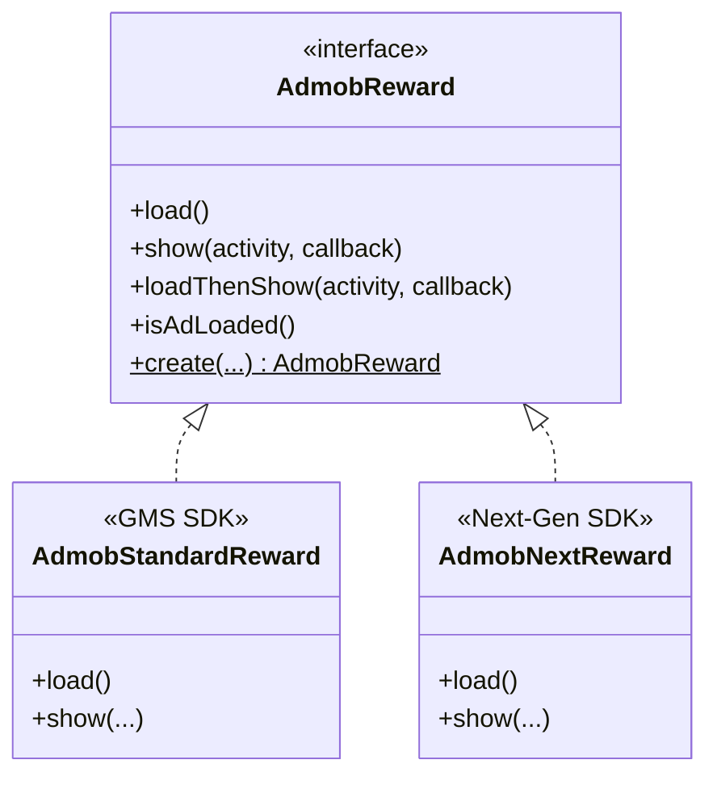

# AdMob Rewarded Ads Integration

This package houses the **Rewarded Ads** integration for the OzAds library. It supports both the **Standard GMS AdMob SDK** and the **GMA Next-Gen SDK** dynamically at runtime.

---

## 🏗️ Architecture & How It Works

We employ a **Polymorphic Interface + Companion Factory** pattern to segregate SDK implementations:



### Dynamic Factory Resolution
The client application and core view wrappers interact solely with the `AdmobReward` interface. The implementation is resolved dynamically at instantiation time:
```kotlin
val rewardAd = AdmobReward.create(context, adUnitId, listener)
```

---

## 🔄 Standard vs. Next-Gen Comparison

| Feature | Standard GMS SDK (`AdmobStandardReward`) | GMA Next-Gen SDK (`AdmobNextReward`) |
|---|---|---|
| **Underlying Class** | `com.google.android.gms.ads.rewarded.RewardedAd` | `com.google.android.libraries.ads.mobile.sdk.rewarded.RewardedAd` |
| **API Architecture** | Imperative, main-thread loading | Modern, asynchronous, background-safe loading |
| **Preloading** | Preload via standard lifecycle hooks | Built-in SDK-level Preloader (`RewardedAdPreloader`) |

---

## 📖 Official Next-Gen Integration Guide Below
*(The section below contains Google's official documentation for the GMA Next-Gen SDK)*

Rewarded ads allow you to reward users with in-app items for interacting with video ads, playable ads, and surveys.
Prerequisites
Set up GMA Next-Gen SDK.
Always test with test ads
When building and testing your apps, make sure you use test ads rather than live, production ads. Failure to do so can lead to suspension of your account.

The easiest way to load test ads is to use our dedicated test ad unit ID for Android rewarded ads:

ca-app-pub-3940256099942544/5224354917

It's been specially configured to return test ads for every request, and you're free to use it in your own apps while coding, testing, and debugging. Just make sure you replace it with your own ad unit ID before publishing your app.

For details on GMA Next-Gen SDK test ads, see Enable test ads.

Load an ad
To load an ad, GMA Next-Gen SDK offers the following:

Load with the single ad loading API.

Load with the ad preloading API, which eliminates the need for manual ad loading and caching.

Load with the single ad loading API
The following example shows you how to load a single ad:

Kotlin
Java

import com.google.android.libraries.ads.mobile.sdk.common.AdLoadCallback
import com.google.android.libraries.ads.mobile.sdk.common.AdRequest
import com.google.android.libraries.ads.mobile.sdk.common.FullScreenContentError
import com.google.android.libraries.ads.mobile.sdk.common.LoadAdError
import com.google.android.libraries.ads.mobile.sdk.rewarded.RewardedAd
import com.google.android.libraries.ads.mobile.sdk.rewarded.RewardedAdEventCallback
import com.google.android.libraries.ads.mobile.sdk.MobileAds

class RewardedActivity : Activity() {
private var rewardedAd: RewardedAd? = null

override fun onCreate(savedInstanceState: Bundle?) {
super.onCreate(savedInstanceState)

    // Load ads after you inititalize GMA Next-Gen SDK.
    RewardedAd.load(
      AdRequest.Builder(AD_UNIT_ID).build(),
      object : AdLoadCallback<RewardedAd> {
        override fun onAdLoaded(ad: RewardedAd) {
          // Rewarded ad loaded.
          rewardedAd = ad
        }

        override fun onAdFailedToLoad(adError: LoadAdError) {
          // Rewarded ad failed to load.
          rewardedAd = null
        }
      },
    )
}

companion object {
// Sample rewarded ad unit ID.
const val AD_UNIT_ID = "ca-app-pub-3940256099942544/5224354917"
}
}
Load with the ad preloading API
To start preloading, do the following:

Initialize a preload configuration with an ad request.

Start the preloader for rewarded ads with your ad unit ID and preload configuration:

Kotlin
Java

private fun startPreloading(adUnitId: String) {
val adRequest = AdRequest.Builder(adUnitId).build()
val preloadConfig = PreloadConfiguration(adRequest)
RewardedAdPreloader.start(adUnitId, preloadConfig)
}

When you're ready to show the ad, poll the ad from the preloader:

Kotlin
Java

// Polling returns the next available ad and loads another ad in the background.
val ad = RewardedAdPreloader.pollAd(adUnitId)

Set the RewardedAdEventCallback
The RewardedAdEventCallback handles events related to displaying your RewardedAd. Before showing the rewarded ad, make sure to set the callback:

Kotlin
Java

// Listen for ad events.
rewardedAd?.adEventCallback =
object : RewardedAdEventCallback {
override fun onAdShowedFullScreenContent() {
// Rewarded ad did show.
}

    override fun onAdDismissedFullScreenContent() {
      // Rewarded ad did dismiss.
      rewardedAd = null
    }

    override fun onAdFailedToShowFullScreenContent(
      fullScreenContentError: FullScreenContentError
    ) {
      // Rewarded ad failed to show.
      rewardedAd = null
    }

    override fun onAdImpression() {
      // Rewarded ad did record an impression.
    }

    override fun onAdClicked() {
      // Rewarded ad did record a click.
    }
}
Show the ad
To show a rewarded ad, use the show() method. Use an OnUserEarnedRewardListener object to handle reward events.

Kotlin
Java

// Show the ad.
rewardedAd?.show(
this@RewardedActivity,
object : OnUserEarnedRewardListener {
override fun onUserEarnedReward(rewardItem: RewardItem) {
// User earned the reward.
val rewardAmount = rewardItem.amount
val rewardType = rewardItem.type
}
},
)
FAQ
Is there a timeout for the initialization call?
After 10 seconds, GMA Next-Gen SDK invokes the OnInitializationCompleteListener even if a mediation network still hasn't completed initialization.
What if some mediation networks aren't ready when I get the initialization callback?
We recommend loading an ad inside the callback of the OnInitializationCompleteListener. Even if a mediation network is not ready, GMA Next-Gen SDK still asks that network for an ad. So if a mediation network finishes initializing after the timeout, it can still service future ad requests in that session.

You can continue to poll the initialization status of all adapters throughout your app session by calling MobileAds.getInitializationStatus().

How do I find out why a particular mediation network isn't ready?
AdapterStatus.getDescription() describes why an adapter is not ready to service ad requests.

Does the onUserEarnedReward() callback always get called before the onAdDismissedFullScreenContent() callback?
For Google ads, all onUserEarnedReward() calls occur before onAdDismissedFullScreenContent(). For ads served through mediation, the third-party ad network SDK's implementation determines the callback order. For ad network SDKs that provide a single close callback with reward information, the mediation adapter invokes onUserEarnedReward() before onAdDismissedFullScreenContent().

Example
Download and run the example app that demonstrates the use of the GMA Next-Gen SDK.